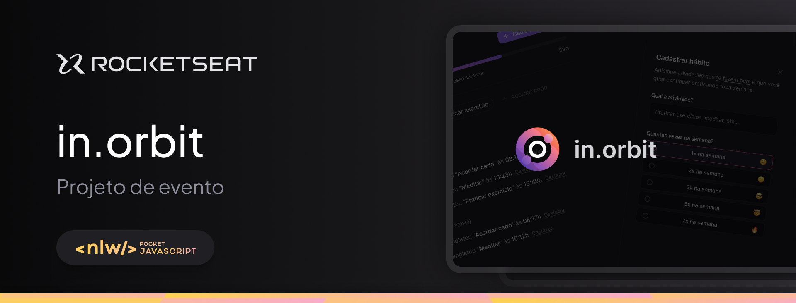
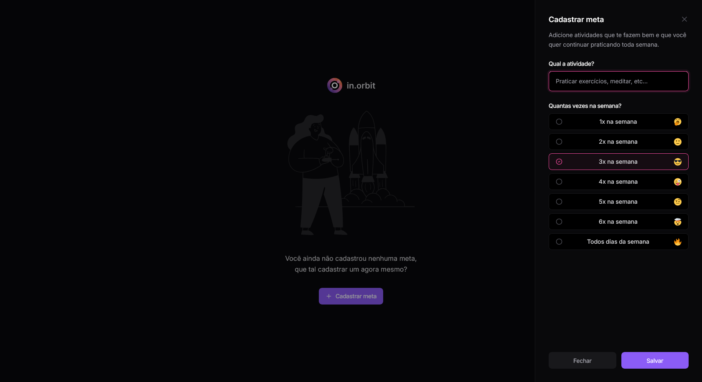
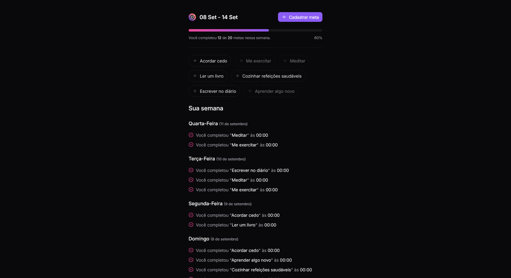

# in.Orbit - Gerenciador de Metas

Bem-vindo ao **in.Orbit**, um gerenciador de metas desenvolvido durante a **Next Level Week (NLW)** da **Rocketseat**, de 09 a 12 de setembro. Este projeto foi criado como parte da trilha **Full-stack Intermediário**, com foco em ferramentas e tecnologias modernas de desenvolvimento web.

## 🛠️ Tecnologias Utilizadas

- **JavaScript**: Desenvolvimento de lógica de programação no front-end e back-end.
- **Docker**: Contêiner para banco de dados PostgreSQL.
- **Fastify**: Framework web rápido e flexível para o back-end.
- **Zod**: Validação de dados no front-end e back-end.
- **Drizzle**: Simplificação da interação com banco de dados.
- **TailwindCSS**: Estilização moderna e responsiva.
- **Vite**: Ferramenta de build rápida para front-end.
- **React Query**: Gerenciamento de estado assíncrono no front-end.

## 📚 Aprendizados

Este projeto foi desenvolvido com o intuito de aprimorar as habilidades em:

- Desenvolvimento Full-stack com JavaScript.
- Uso de Fastify para criação de APIs rápidas.
- Validação de dados com Zod.
- Estilização moderna com TailwindCSS.
- Gerenciamento de estado com React Query.

## 💻 Confira algumas capturas

## 🏆 Créditos

Este projeto foi desenvolvido durante a **Next Level Week** da **Rocketseat**, na trilha **Full-stack Intermediário**. Agradecimentos a toda a comunidade Rocketseat por fornecer um ambiente de aprendizado contínuo e suporte durante o desenvolvimento.